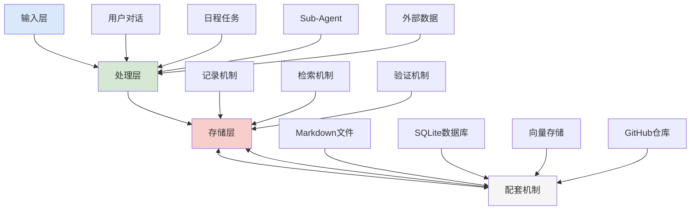

# 三锤记忆系统架构

## 系统概述

三锤记忆系统是一个专为多Agent协作设计的记忆管理架构，旨在解决AI Agent"无状态困境"。系统采用三层架构设计，通过结构化的记忆格式、混合检索机制和自动化工作流，实现了信息的持久化存储、高效检索和智能验证。

## 三层架构详解

### 1. 输入层

输入层负责从各种源头收集信息和触发记忆操作：

| 输入源 | 说明 |
|--------|------|
| **用户对话** | 主对话/群聊中的实时交互信息 |
| **日程任务** | 每日整理任务、监控任务等定时触发 |
| **Sub-Agent** | 异步任务执行中的上下文和结果 |
| **外部数据** | GitHub、微博、邮件等外部渠道的数据 |

### 2. 处理层

处理层是记忆系统的核心，包含三大机制：

#### 记录机制
- **MemCell格式**：叙事 + 事实 + 预测的结构化记忆单元
- **标签系统**：通过 `#type/#priority` 进行分类和优先级标记
- **Foresight**：预测追踪机制，对未来事件进行前瞻性管理

#### 检索机制
- **FTS5**：基于SQLite FTS5的关键词全文检索
- **向量检索**：1024维向量语义相似度匹配（百炼API）
- **RRF混合**：Reciprocal Rank Fusion融合排序算法，提升检索准确性

#### 验证机制
- **事实追踪**：记录事实的变更历史
- **预测验证**：到期检查预测的准确性
- **冲突检测**：自动识别和标记矛盾信息

### 3. 存储层

存储层采用多级存储策略，确保数据的持久性和可访问性：

| 存储类型 | 说明 |
|----------|------|
| **Markdown文件** | 四层架构：SOUL.md、MEMORY.md、USER.md、SECRET.md |
| **SQLite数据库** | memory.db，包含memcells、facts、vectors表及FTS5索引 |
| **向量存储** | 百炼API提供的1024维向量空间 |
| **GitHub私有仓库** | sanchui-memory仓库，实现云端备份和同步 |

## 核心机制详解

### MemCell记忆单元

MemCell是系统的核心记忆单元，采用三层结构：

```text
MemCell {
  叙事层：自然语言描述的上下文和背景
  事实层：结构化的关键事实和数据
  预测层：对未来事件的预测和假设
}
```

### RRF混合检索

RRF（Reciprocal Rank Fusion）通过融合多个检索结果来提升准确性：

```text
RRF Score = Σ 1/(k + rank_i)

其中：
- rank_i：该文档在第i个检索方法中的排名
- k：平滑参数（通常取60）
```

### Foresight预测机制

Foresight机制允许系统对未来事件进行前瞻性管理：

- 预测事件的创建和标记
- 到期自动验证预测准确性
- 基于预测调整行为策略

## 配套自动化机制

系统配套了一系列自动化脚本和定时任务，确保记忆系统的自主运行：

| 机制 | 说明 |
|------|------|
| **每日记忆整理** | 每天8:00自动执行，整理和归档前一天的记忆 |
| **自动归档** | 文件超过40KB时触发自动归档操作 |
| **GitHub同步** | 自动推送本地变更到私有仓库 |
| **MemScene索引** | 场景聚合索引，便于按场景检索记忆 |
| **自动化脚本** | 抽取、检索、同步等操作的脚本化实现 |

## 技术实现

### SQLite + FTS5

系统使用SQLite作为主数据库，充分利用FTS5全文检索能力：

```sql
-- memcells表结构
CREATE TABLE memcells (
  id INTEGER PRIMARY KEY,
  narrative TEXT,
  facts TEXT,
  foresight TEXT,
  tags TEXT,
  created_at DATETIME,
  updated_at DATETIME
);

-- FTS5虚拟表
CREATE VIRTUAL TABLE memcells_fts USING fts5(
  narrative, facts, tags,
  content=memcells,
  content_rowid=id
);
```

### 向量检索

通过百炼API生成1024维向量，实现语义相似度检索：

```python
# 向量检索示例
import numpy as np
from sklearn.metrics.pairwise import cosine_similarity

def vector_search(query_vector, top_k=5):
    similarities = cosine_similarity(
        query_vector.reshape(1, -1),
        stored_vectors
    )
    top_indices = similarities.argsort()[0][-top_k:][::-1]
    return top_indices
```

## 数据流



## 设计优势

1. **结构化记忆**：MemCell格式确保记忆的完整性和可追溯性
2. **混合检索**：结合关键词和语义检索，提升召回率和准确率
3. **自动化运行**：通过定时任务和脚本实现无人值守的记忆管理
4. **多级存储**：Markdown可读性强，SQLite检索高效，GitHub云端备份
5. **预测验证**：Foresight机制让系统具备前瞻性思考能力

## 后续优化方向

- [ ] 引入Gigabrain的实体链接机制，建立人物/关系图谱
- [ ] 实现梦境循环（夜间自动优化记忆）
- [ ] 增强RRF融合算法的参数自适应能力
- [ ] 开发记忆版本控制和回滚机制
- [ ] 构建跨Agent的记忆共享协议

---

*系统版本：v1.0*  
*最后更新：2026-04-15*  
*维护者：三锤*
